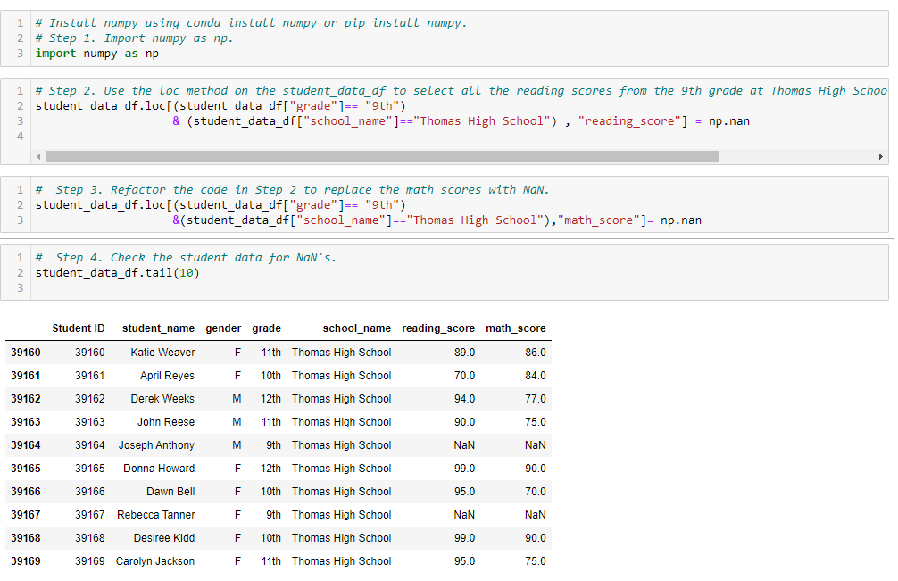
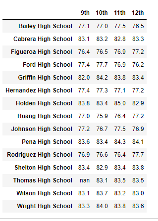
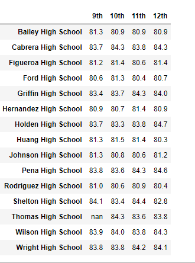
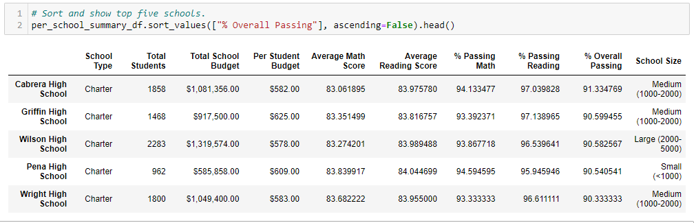
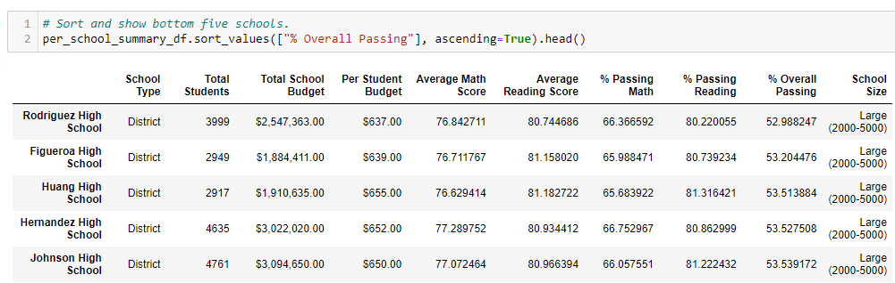
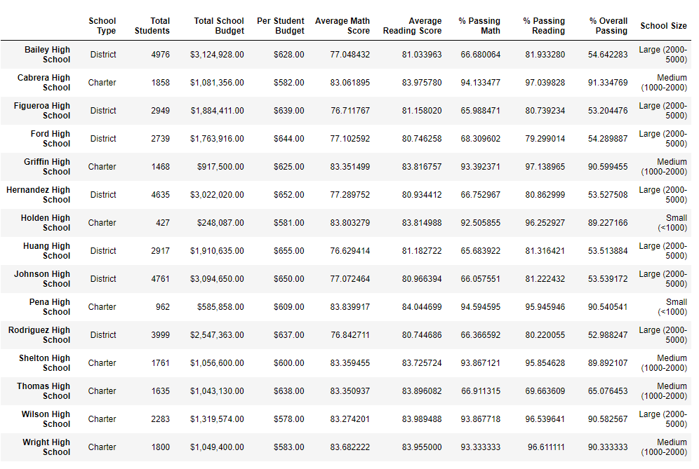

# School_District_Analysis
### Overview

##### Preparing standardized reading and math test data for analysis, reporting and presentation on performance trends and patterns in reference to student funding.  After my first analysis of the school data, I was informed that there had been academic dishonesty; specifically, reading and math grades for Thomas High School ninth graders. After removing the test scores of Thomas High School ninth graders, I repeated the analysis and noted changes in the overall analysis. 

##### I used the loc method to select all the reading and math scores from the ninth graders at Thomas High School and removed their scores from the data. 

---

### Results:

##### The change in th data did not change anything for the other district schools. 
##### The average math score for each grade level from each school. 

#The average reading score for each grade level from each school

##### The top 5 and bottom 5 performing schools, based on the overall passing rate. 

---

### Summary:
##### The scores by school spending per student, by school size, and by school type

